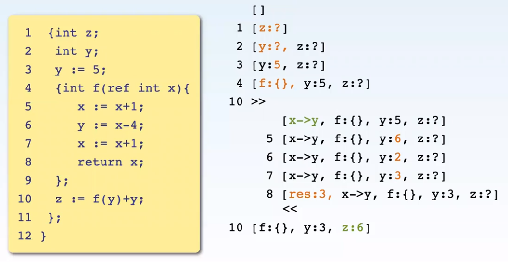
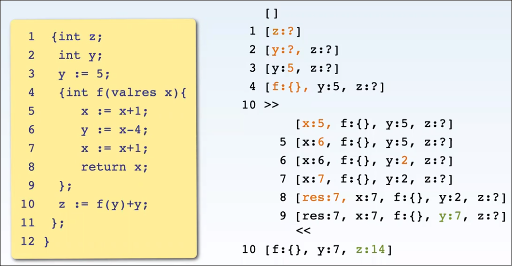
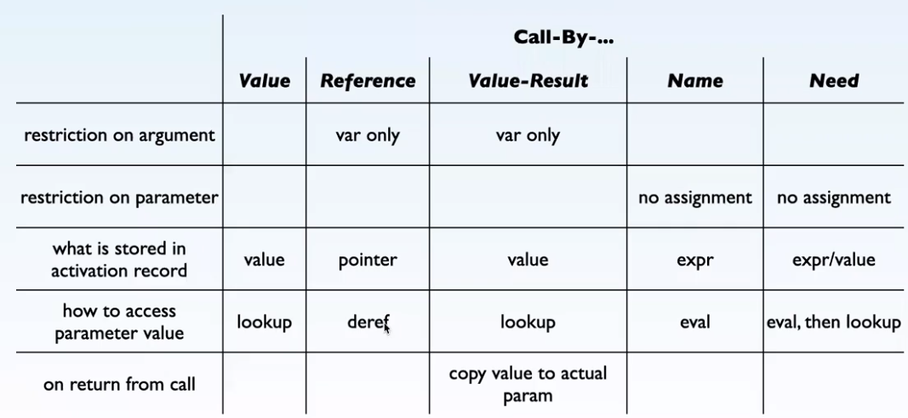

# Quiz 1 / Haskell Learning Notes

### Main Function-like Structure

```haskell
main = do
	--...
```

### General
- prefix operator ``mod 4 3``, comes before values
- infix operator with backticks ``4 `mod` 3``
- constant definition `name :: Type` or `name = val :: Type`
- lists `[a..b]` is valid, will fill in between a and b
- negatives must be enclosed in parenthises `(-12)`
- reading info about function (from `:t` in `ghci`, i.e. `:t sqrt`): `sqrt :: Floating a => a -> a` means it works with floats, and takes one input and outputs one output. I.e. for all `Floating a`, this function does `a -> a`
- `fromIntegral val` returns `Floating` from `Int`
- logical not: `not(a)`
- `repeat n` repeats n forever.
- `replicate a b` replicate b a times
- `show a` prints var `a` as string
- `\=` is the not equal operator.
- `$` denotes precedence - anything after it takes precedence over anything before it

### I/O
- `putStrLn "text"`
- `var <- getLine`

### File I/O
- `fileVar <- openFile "name.txt" WriteMode`
- put data to file with `hPutStrLn fileVar ("lala")`
- read data from file with `contents <- hGetContents fileVar`
- close with `hClose fileVar`

### Lists
- create list: `[val1, val2]`
- concat lists: `list1 ++ list2`
- construct list: `a : b : c : []` will create `[a, b, c]`
- `length a` gives length of list `a`
- `reverse a` reverses list `a`
- check if list is empty with `null a`
- get item at index i in list a: `a !! i`
- `head` (first), `last`, `init` (all but last)
- `take n a` get first n of a
- `drop n a` remove first n of a
- ``b `elem` a`` b in a?
- infinite lists `[1, 2 ..]`
- `cycle a` will replicate a forever.
- `sum = zipWith (+) a b` will sum the lists together.
- `filter (>5) a` will filter a list by elements beign greater than 5
- `takeWhile (<=20) [1, 2 ..]` will keep getting elements from `[1, 2, ..]` until condition not met
- `foldr` and `foldl` (from right or left respectively) will do operation on each element, i.e. `foldl (*) 1 a` will take the product of all items in a

#### List Comprehensions
- simple:  `[3^n | n <- [1..10]]` generates powers of three for each item in `1..10`
- listcomp with `[x * 2 | x <- [1..10], x * 2 <= 8]` will generate `[2, 4, 6, 8]`, more filters can be added separated by commas, i.e. `[x * 2 | x <- [1..10], x * 2 <= 8, x < 4]` or whatever.
- listcomp nesting: `a = [[x * y | y <- [1..10]] | x <- [1..10]]` will generate nested list.

#### List Segmenting
- you can get certain items from a list by using `(x:y:...:xs)` xs is the rest, x is the first element.
- collect the whole parameter in variable `all` using `funcName all@(x:xs)`

### Tuples
- `a = (b, c)` where `b` and `c` do not have to share same type (unlike list)
- first element `fst a` where a is the tuple
- second element `snd a` where a is the tuple
- create tuples from lists `num = [1, 2, 3]`, `chars = ['a', 'b', 'c']`: `zip num chars` --> `[(1, 'a'), (2, 'b'), (3, 'c')]`.

### Functions
- `let funcname x = x^9` will return the ninth power of the number provided.
```haskell
addMe :: Int -> Int -> Int
addMe x y = x + y
```
- blank argument `fname _ = 1337` will return `1337` no matter input

### Guards
```haskell
funcName :: Int -> Bool
funcName n
	| n `mod`2 == 0 = False # return false if even
	| otherwise = True
```
- You can include functions within some or all guards bu using a `where` clause: same indent as the last guard, but no guard bar. `where fname = operations`

### Higher Order Functions
```haskell
t4 :: Int -> Int
t4 n = n * 4

listt4 = map t4 [1..10]
```
- `map a b` applies function a to all in b
- Function defenition for a higher order function includes `(passed_func) -> other`, i.e. `(Int -> Int) -> Int` in the case of a function that gets passed a function (first arg) that takes an int, and returns another.

### Lambda Functions
- Defined using the notation: `outer = map (\x -> x * 2) [1..10]` will perform the unnamed function `x -> x * 2` on each element of `1..10` using map.

### Conditional Structures
- if statement: 
```haskell
funcName a = 
	if (condition)
		then b
		else c
```
- case statement: 
```haskell
funcName :: Int -> String
funcName n= case n of
	a -> b
	...
	c -> d
	_ -> -- otherwise
```

### Type Things
#### Enumerated Types
```haskell
data TypeName = val1 | val2 | ... | valn
```
- can be followed by `deriving Show` to ne able to use as string

#### Custom Types
```haskell
data Name = Name t1 t2 ... tn
	deriving show
```
- Instantiate with `varName = Name val1 ... valn`
- retrieve information with a function like ```haskell
get3rd :: Name -> outType
get3rd (Name _ _ a) = a
```

#### Custom + Enumerated Types
```haskell
data Shape = Circle Float Float Float | Rectangle Float Float Float Float
	deriving Show
```
- This can be used by defining functions that depend on type passed: 
```haskell
area (Circle _ _ r) = pi * r ^ 2
area (Rectangle a b c d ) = #...
```

#### Type Classes
- i.e. `Num`, `Eq`, `Show`
- Correspond to sets of types with defined functions
	- ex: `Num` type class is used for `(+)` operator
- defining new type with classes: 
```haskell
data Name = Name { var :: type,
					...
				  	varn :: typen} deriving (Classes)
```
- above, the `Classes` can be type classes that can be used with this type. These can be like `Eq`, `Show` ...
- Using Type Enumeration and overriding builtin type class: 
```haskell
data ShirtSize S | M | L
instance Eq ShirtSize where
	S == S = True
	M == M = True
	L == L = True
	_ == _ = False

instance Show ShirtSize where
	show S = "Small"
	show M = "Medium"
	show L = "Large"
```
- Custom type class: 
```haskell
data ShirtSize S | M | L

class MyEq where
	areEqual :: a -> a -> Bool

instance MyEq ShirtSize where
	areEqual S S = True
	areEqual M M = True
	areEqual L L = True
	areEqual _ _ = False
```

### Modules
- We load modules to get at functions. 
- defined at top of module file in format `module Name (f1, ..., fn) where` followed by function defenitions.
# Quiz 2 Learning Notes

### Function Composition
- `funcName xs = f1(f2 xs)` can be rewritten as `funcName = f1 . f2`. 
- safer since we are not handling variables.

### Implicit Argument Passing
```hs
positive :: Int -> Bool

--non implicit
positive x = x>=0

--on the fly constructed function
positive x = (>=0) x

--implicit
positive = (>=0)
```

### Data Constructors
```hs
data Nat = Zero
			| Succ Nat
```
- here, natural numnber `two` can be represented as `Succ(Succ Zero)`. 
- List type can be remade like this, too, wherein
```hs
data List = Empty
			| Cons Type List
```
- here, this creates a linked list (on the heap). When initialized like `xs = Cons 1 (Cons 2 Empty)`, we see a linked list in the format `Cons 1 --> Cons 2 --> Empty`

#### Avoiding Sharing
- Some definitions, like
```hs
data List = Empty
			| Cons Nat List

one = Succ Zero
two = Succ one
ys = Cons one (Cons two Emty)
```
- we have `one` referenced by (~pointed to by) both `two` and `ys`, as `two` is `Succ one`
- can be fixed by replacing `two = Succ one` with `two = Succ (Succ Zero)`
- sharing increases efficiency slightly, but makes garbage collection a bit harder.

#### Cyclic Data Structures
- when a constructor points to itself, or a previous constructor. Some examples
```hs
data List = Empty
			| Cons Int List

ones = Cons 1 ones -- points to itself
morse = Cons 1 (Cons 0 morse) -- points to Cons 1 (...)

zeros = Cons 0 zeros -- that's a lot of 0's
big = Cons 1 zeros -- one then alot of 0's
```

### Ignoring Errors
```hs
head [] --ERROR

ignore :: a -> String
ignore x = "Nope"

ignore(head []) -- "Nope"
```
- in haskell, you pass the whole expression into ignore, which is not evaluated as it is not needed. Therefore, the error creating function is not evaluated.

### Type Derivations
```hs
data Grade = A | B | C | D | F
			deriving Eq ...

instance Show Grade where
	show A = "1.0" 
	...
```
- This will not be on quizzes or tests

### Grammar
- Grammar is given by a set of rules == productions
- production looks like `A ::= B C`, where A makes up the `LHS`, B and C make up the `RHS`, and A, B and C are all symbols, or strings.
- example grammar
```
sentence ::= noun verb noun		(R1)
noun     ::= dogs				(R2)
noun     ::= teeth				(R3)
verb     ::= have				(R4)
```
- `sentence`, `noun`, `verb` above are nonterminal symbols, as they can be replaced by their RHS.
- `dogs`, `have`, `teeth` are terminal symbols, as they cannot be expanded further.
- we can derive sentences from nonterminal symbols, through repeated substitution.  
- empty rules are epsilon rules. They are represented like `bin ::= Є`
- derivation is the process of producing a sentence in accordance with the rules of the grammar.

#### Context Free Grammar
- grammar where LHS contains only one symbol.
- each iteration of LHS is replaced by RHS no matter context

### Syntax Tree
- all leaves are terminal symbols
- all internal nodes are nonterminal symbols
- nonterminal in the tree root indicates the type
- derivation order is not captured in the tree, as we do not care abou the derivation process. All we care about is that the final output is a valid grammar.
- can also replace internal nodes with rulenames

### Abstract vs Concrete Syntax
#### Concrete Syntax
- concrete syntax is the set of all sentences or strings that can be developed from a grammar. 
- it is more verbose, and more readable
- contains extra keywords and symbols to help parsing

#### Abstract Syntax
- abstract view is the set of all syntax trees that a grammar can produce
- more concise
- represents essential language structure
- basis for analysis and transformations

### Abstract Syntax
- abstract syntax tree is synonimous with the value of a haskell data type.
- some syntax trees can be reduced, by removing redundant rules, for example a rule where there is only one possible expansion that has start and end that are in the graph, the intermediate node with rule Rn does not need to be present
- can be represented linearly, in text, where:
```
sentence ::= noun verb noun			(R1)
			| sentence and sentence (R2)
noun     ::= dogs | teeth			(R3, R4)
verb     ::= have					(R5)

Tree:
		R1
	   / | \
	 R3 R5 R4
	/    |   \
  dogs have teeth

Simplified Tree
		R1
	 /   |   \
  dogs have teeth

Linearly
R1 dogs have teeth

More complex (different sentence)
R2(R1 dogs have teeth)
  (R1 dogs have dogs)
```

#### Abstract Syntax and Haskell
- abstract syntax allows us to do do a bunch of interesting stuff, using hashell as a meta language.
- Translation steps:
	- for each nonterminal, define a data type
	- for each rule, define a constructor
- Haskell type names must be capitalized.
- above example is converted as follows
```hs
--sentence ::= noun verb noun			(R1)
--			| sentence and sentence (R2)
--noun     ::= dogs | teeth			(R3, R4)
--verb     ::= have					(R5)

data Sentence = Cons1 Noun Verb Noun | Cons2 Sentence Sentence
data Noun = Dogs | Teeth
data Verb = Have

--to create tree
--		R1
--	 /   |   \
--dogs have teeth

Cons1 Dogs Have Teeth

--to create and sentence like
--R2(R1 dogs have teeth)
--  (R1 dogs have dogs)

Cons2 (Cons 1 Dogs Have Teeth) (Cons1 Dogs Have Dogs)
```
- `Cons1`, `Cons2` are constructors for nonterminals. They can be called `Phrase` and `And`, `R1` and `R2`, ...

### Abstract Grammar
- synonymous with Haskell data type
- contains exactly one unique terminal symbol in each rule, and no redundant rules.
- for example, taking the concrete grammar below, we can make the abstract grammar:
```
Concrete Grammar:
cond ::= T | not Cond (cond)
stmt ::= while cond { stmt }
		| noop

Abstract Grammar:
data Cond = T | Not Cond
data Stmt = While Cond Stmt
		| Noop
```
- while a concrete grammar can generage a set of sentences, an abstract one can produce an abstract syntax tree.

### Concrete Syntax Tree
- created as follows
```
Sentence:
while not(not(T)) {
	while T { noop }
}

Grammar
cond ::= T | not (cond)
stmt ::= while cond { stmt }
		| noop

Tree:
```


### Abstract Syntax Tree
- for code:
```hs
While (Not (Not (T))
	(While T Noop)

data Cond = T | Not Cond
data Stmt = While Cond Stmt
			| Noop

Tree:

       While
      /     \
   Not      While
    |      /     \
   Not     T     Noop
    |
    T
```

#### CST to AST
Take the the first terminal of each nonterminal, forget the remaining terminal characters. Replace the nonterminal with the terminal.

### What Makes an Acceptable Data Type for Abstract Syntax
- must represent all sentences in a language, no more and no less.
- names and order of arguments to constructors do not matter.
- one constructor may represent multiple productions.
- there may be multiple ways to represent one sentence in different ways.
```
data Ints = One Int | Join Ints Ints

List [2, 4, 5] can be 
- Join (One 2) (Join (One 4) (One 5))
- Join (Join (One 2) (One 4)) (One 5)
```

### Pretty Printing and Parsing
- pretty printing abstract syntax creates concrete syntax
- parsing concrete syntax creates abstract syntax

### Grammar Rules for Lists (Simplifications)
- a string is a list of characters, i.e. we can condense like this:
```
Concrete
string ::= char string | Є
char ::= a | b | c ...

create string aac

Abstract
data Str = Seq Chr Str | Empty
data Chr = A | B | ...

aac = Seq A (Seq A (Seq C Empty))

But, char array is a string, so abstract syntax can also be either

data Str = Seq [Char] (using builtin char)

or

type String = [Char] (using Char and String builtins)
```
- same can happen with numbers.
- concrete syntax `rule*` means that that rule is a list of that rule, i.e. `rule*` expands to `rule rule* | Є`. This becomes [rule] in abstract.
- concrete syntax `rule+` means there is at least one instance of that rule. This expands to `As ::= A As | A`, and in abstract becomes either rule or [rule].

### Data Types vs Types
- difference:
```hs
type Point = (Int, Int)
(3,5) :: Point 		[OK]
(3,5) :: (Int, Int) [OK]
-- essentially, Point is the same as (Int, Int).
```
- versus
```hs
data Point = Pt Int Int
Pt 3 5 :: Point 	[OK]
Pt 3 5 :: (Int, Int)[ERROR]
```
- data type is used when
	- more than one constructor is needed
	- pretty printing is required
	- representation might be hidden (ADT)

### Grammars to Data Types
1. represent each **basic nonterminal** as a **built in type**
2. for each **other nonterminal**, define a **data type**
3. for each **production**, define a **constructor**
4. **argument types** of constructors are given by the productions **nonterminals**.

- **Each case of a data type must have a constructor (see `N`, `Plus`, `While`, `Noop` below).**

```hs
-- exp  ::= num | exp + exp  | (exp)
-- stmt ::= while exp { stmt }
--		| noop

data Exp = N Int | Plus Exp Exp
data Stmt = While Exp Stmt
		| Noop

-- Num is probably defined somewhere else
-- exp and stmt are nonterminals, so we make data types for them
```# Quiz 3 Learning Notes

Scope: all locations in a program where a symbol is visible

### Blocks
- a group of declarations and 
	- a sequence of statements (for imperative programming) or 
	- an expression (functional programming)

#### Locals and Non-Locals
- a local variable is defined in the same block
- a non-local is not defined in the same block
```
{	int x
	x := 10;
	y := 11;
	{ 	int y;
		y = 99;
	}
}
```
- above, `y` in the inner block is used as a local. It's value **shadows** (i.e. replaces) the non-local declared on line 3. 
- locals are kept in memory blocks called activation records, on the runtime stack

### Dynamic Scoping
- when calling a function that uses a non-local variable in its declaration, the most recent activation record of that variable name is the one that comes in to play when the function is called.


### Static Scoping
- variables in function implementations are required to be visible (i.e. in scope) at the implementation / definition, not at call time. 
- essentially implemented by storing an "access link" (pointer) to the activation record to the variable(s) used in the function, in that function's activation record.
	- you can follow variable access links at runtime to get values or
	- you can push activation record for f on to the stack pointed to by the activation record (i.e. temporary stack)
- the variable referenced in the function is the one that was declared at the time of function declaration, and that is what is changed, too, if the function changes something.

#### Static Scoping Recursion
- f()'s access link points to f() itself, so that when we call that function, the argument of that function is prepended to the stack, and the contents that are statically visible are at the end, i.e. `[[y:5, f(), x:1], [y:4, f(), x:1] [...] ... ]`

### Parameter Passing
- example parameter passing schemes will be explained with variations of this three part function example:
	- Interface: `func(par, ...)`
	- Implementation: `...code... \ par * ... \ ...code...`
	- Call: `func(...)`
- A function call typically includes:
	1. evaluate argument expressions (i.e. `func(x+1)`)
	2. Create activation record with parameter names on runtime stack
	3. store values and locations in acticvation record
	4. transfer control to function, run code
	5. pass values back to call site
	6. clean up runtime stack

#### Call By Value
- values flow only in
1. evaluate argument expressions (i.e. `func(x+1)`)
2. Create activation record with parameter names on runtime stack
3. store values ~~and locations~~ in acticvation record
4. transfer control to function, run code
5. ~~pass values back to call site~~
6. clean up runtime stack
- cannot have any effect as it does not return anything / change anything outside scope.


#### Call By Reference
- values flow in and out
1. ~~evaluate argument expressions (i.e. `func(x+1)`)~~ only variables can be arguments
2. Create activation record with parameter names on runtime stack
3. store ~~values~~ and locations in acticvation record
4. transfer control to function, run code
5. ~~pass values back to call site~~
6. clean up runtime stack



#### Call By Value Result
- value flow in and out
- aka copy in copy out
1. ~~evaluate argument expressions (i.e. `func(x+1)`)~~ only variables can be arguments
2. Create activation record with parameter names**and their values, not references** on runtime stack
3. store values ~~and locations~~ in acticvation record
4. transfer control to function, run code
5. pass values back to call site - write final values back to their variables
6. clean up runtime stack
- copy out happens **before** result assignment.



#### Call By Name
- value flow in
1. ~~evaluate argument expressions (i.e. `func(x+1)`)~~
2. Create activation record with parameter names on runtime stack
3. store ~~values and locations~~ **expressions** in acticvation record
4. transfer control to function, run code
5. ~~pass values back to call site~~
6. clean up runtime stack


#### Call By Need
- value flow in
1. ~~evaluate argument expressions (i.e. `func(x+1)`)~~
2. Create activation record with parameter names on runtime stack
3. store ~~values and locations~~ **expressions, replcaed by values** in acticvation record
4. transfer control to function, run code
5. ~~pass values back to call site~~
6. clean up runtime stack


#### Comparison




# Quiz 4 Learning Notes

### Prolog
- untyped
- computations are expressed with rules that define relations on objects
- running a program / computing a value: formulating a goal or a query
- result of program execution: Yes / No and a binding of free variables
- no higher order predicates

#### Facts, Rules and Prolog
```
For All X: Hunam(x) --> Mortal(x) <-- Rule 			\
Human(Socrates)					  <-- Fact 			,`-> Prolog Program
Therefore: Mortal(Socrates)		  <-- Goal / Query  ---> Program Execution
```

#### Predicates and Sets
- for all intents and purposes, predicates (the basic entities in Prolog) are equivalent to sets
	- i.e. predicates ~= relaion ~= set

### Prolog Facts
- to define the set `color = {red, blue}`:
```prolog
color(red).
color(blue).
```
- to define set `likes = { (john, red), (mary, red), (john, mary) }`:
```prolog
likes(john, red).
likes(mary, red).
likes(john, mary).
```
- above, we are defining the `likes` predicate.

### Prolog Goals and Queries
- after defining the `color` predicate, we can ask prolog for the goal: 
	- `?- color(red)` will result in `true.`
	- `?- color(green)` will result in `false.` (closed world assumption)
- `false.` means that it cannot be determined with the information given.

### Variables
- we can set variables: `?- color(X)` will return (see def's above) `X = red`. 
	- if we hit return, we are satisfied
	- if we enter `;`, we want to see what else X can be (namely `X = blue`)
- another example is doing `?- likes(X, blue)` which will return `false.`
- variables are first order, cannot be used for predicates

### Conjunctions
- comma `,` means and, so to join two queries, do `likes(john, mary), likes(mary, john).`

### Rules
- rules consist of head (`marry(X, Y)`) and body (`likes(X, Y), likes (Y, X).`)
- `:-` reads as `if`
- free variables: `friends(X, Y) :- likes(X, Z), likes(Y, Z).` X is a free variable.

### Overloading and Arity
- consider the pl:
```
car(bmw).						<-- car/1
car(honda, green).				<-- car/2
car(X, Y) :- car(X), color(Y).	<-- car/2, car/1
faster(car, bike)				
```

### Recursion
```
inside(X, Y) :- contains(Y, X).
inside(X, Y) :- contains(Y, Z), inside(X, Z).
```
- will result in:
```
?- inside(mouse, house).
true.
```
for 
```
contains(house, bathroom).
contains(house, kitchen).
contains(kitchen, fridge).
contains(fridge, mouse).
```

### Inner Prolog Functioning 
- this is tough. refer to slides. 