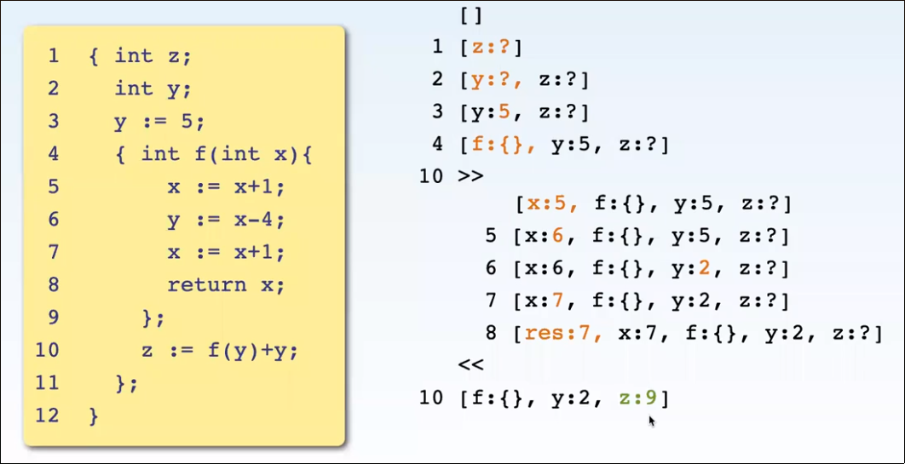

# Quiz 3 Learning Notes

Scope: all locations in a program where a symbol is visible

### Blocks
- a group of declarations and 
	- a sequence of statements (for imperative programming) or 
	- an expression (functional programming)

#### Locals and Non-Locals
- a local variable is defined in the same block
- a non-local is not defined in the same block
```
{	int x
	x := 10;
	y := 11;
	{ 	int y;
		y = 99;
	}
}
```
- above, `y` in the inner block is used as a local. It's value **shadows** (i.e. replaces) the non-local declared on line 3. 
- locals are kept in memory blocks called activation records, on the runtime stack

### Dynamic Scoping
- when calling a function that uses a non-local variable in its declaration, the most recent activation record of that variable name is the one that comes in to play when the function is called.


### Static Scoping
- variables in function implementations are required to be visible (i.e. in scope) at the implementation / definition, not at call time. 
- essentially implemented by storing an "access link" (pointer) to the activation record to the variable(s) used in the function, in that function's activation record.
	- you can follow variable access links at runtime to get values or
	- you can push activation record for f on to the stack pointed to by the activation record (i.e. temporary stack)
- the variable referenced in the function is the one that was declared at the time of function declaration, and that is what is changed, too, if the function changes something.

#### Static Scoping Recursion
- f()'s access link points to f() itself, so that when we call that function, the argument of that function is prepended to the stack, and the contents that are statically visible are at the end, i.e. `[[y:5, f(), x:1], [y:4, f(), x:1] [...] ... ]`

### Parameter Passing
- example parameter passing schemes will be explained with variations of this three part function example:
	- Interface: `func(par, ...)`
	- Implementation: `...code... \ par * ... \ ...code...`
	- Call: `func(...)`
- A function call typically includes:
	1. evaluate argument expressions (i.e. `func(x+1)`)
	2. Create activation record with parameter names on runtime stack
	3. store values and locations in acticvation record
	4. transfer control to function, run code
	5. pass values back to call site
	6. clean up runtime stack

#### Call By Value
- values flow only in
1. evaluate argument expressions (i.e. `func(x+1)`)
2. Create activation record with parameter names on runtime stack
3. store values ~~and locations~~ in acticvation record
4. transfer control to function, run code
5. ~~pass values back to call site~~
6. clean up runtime stack
- cannot have any effect as it does not return anything / change anything outside scope.



#### Call By Reference
- values flow in and out
1. ~~evaluate argument expressions (i.e. `func(x+1)`)~~ only variables can be arguments
2. Create activation record with parameter names on runtime stack
3. store ~~values~~ and locations in acticvation record
4. transfer control to function, run code
5. ~~pass values back to call site~~
6. clean up runtime stack


#### Call By Value Result
- value flow in and out
- aka copy in copy out
1. ~~evaluate argument expressions (i.e. `func(x+1)`)~~ only variables can be arguments
2. Create activation record with parameter names**and their values, not references** on runtime stack
3. store values ~~and locations~~ in acticvation record
4. transfer control to function, run code
5. pass values back to call site - write final values back to their variables
6. clean up runtime stack
- copy out happens **before** result assignment.


#### Call By Name
- value flow in
1. ~~evaluate argument expressions (i.e. `func(x+1)`)~~
2. Create activation record with parameter names on runtime stack
3. store ~~values and locations~~ **expressions** in acticvation record
4. transfer control to function, run code
5. ~~pass values back to call site~~
6. clean up runtime stack


#### Call By Need
- value flow in
1. ~~evaluate argument expressions (i.e. `func(x+1)`)~~
2. Create activation record with parameter names on runtime stack
3. store ~~values and locations~~ **expressions, replcaed by values** in acticvation record
4. transfer control to function, run code
5. ~~pass values back to call site~~
6. clean up runtime stack


#### Comparison


